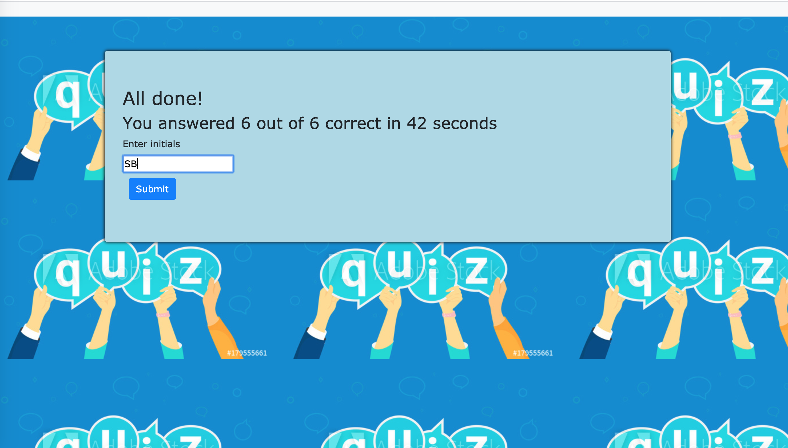
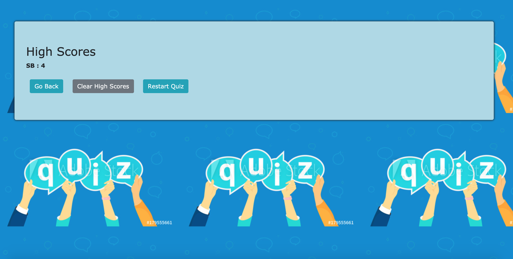

# Code-Quiz

## Project Title: Code-Quiz
## Project Description
This project describes how to create a timer-based quiz application with multiple-choice questions that stores high scores on the client-side. This app will run in the browser and feature dynamically updated HTML and CSS powered by the JavaScript and Jquery code.

## Play proceeds as follows:

* The user arrives at the landing page and is presented with a call-to-action to "Start Quiz" and the quiz instructions.

* Clicking the "Start Quiz" button presents the user with a series of questions. The timer is initialized with 60 seconds and immediately begins countdown.

* Incorrect answers will penalise the time by 5 seconds. Answering quickly and correctly results in a higher score. 

* When time runs out and/or all questions are answered, the user is presented with the final score and asked to enter their initials. Their final score and initials are then stored in localStorage.
## Installation
In order to install this project, follow the instructions below.
* Prerequisites
Laptop (Mac or Windows) with 8 GB RAM and 64-bit dual-core processor
* Install the following programs on your computer
Visual Studio Code
"Open in Browser" Visual Studio Code extension
Git Bash (Windows only)
Terminal (Mac only; preinstalled)
SSH keys

## Accessing the project files on VS Code
* Create a Github account so you can access the project repository, fork it to your account and then clone (make a copy of the repo) onto your local computer
* Using terminal cd into the directory where the repo is cloned and type command "code ." to open the project in VS code to view the project files
* There are three main files index.html, contact.html and portfolio.html and assets folder which contains css folder with style.css and reset.css files and an images folder with all the images used in the project
* The homepage of this project is called index.html which has the code for the landing page for the basic portfolio website, which contains the information about the developer.

## Screenshots of the code-quiz web application
* Here is a screenshot of the landing page of the code-quiz application

* Here is a screenshot of the question when displayed

* Here is a screenshot of the scores display and user initials submission page

* Here is a screenshot of the High scores display and options to clear scores and restart the quiz

